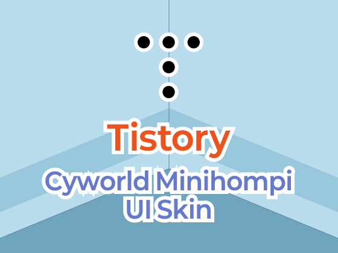

  

  Tistory Cyworld Minihompi UI Skin

 

## Skin 특징

1. 자체 개발한 [@wisdomstar94/torytis](https://github.com/wisdomstar94/torytis) 프레임워크를 사용하여 개발되었습니다.
2. 개발시 scss 와 [TailwindCSS](https://tailwindcss.com/) 가 사용되었습니다.
3. 개발시 [React](https://react.dev/) 가 사용되었습니다.
4. 개발시 [Typescript](https://www.typescriptlang.org/) 가 사용되었습니다.
5. 예전 싸이월드의 미니홈피 UI 를 최대한 비슷하게 구현해보았습니다.
6. 스킨의 최신버전을 자동으로 체크합니다.

 

## 업데이트 이력

[CHANGELOG.md](./CHANGELOG.md) 파일에 업데이트 이력이 기재되어 있습니다.

 

## 라이선스

@wisdomstar94/tistory-cyworld-minihompi-ui-skin 는 [MIT 라이선스](./LICENSE)가 적용됩니다.
